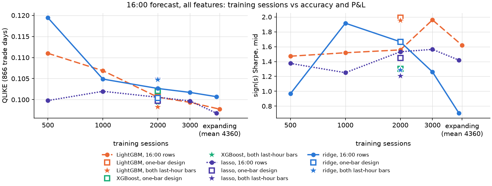

# Trees and training-set size at the 16:00 bar (close study, 2026-10-03)

Question (the user's note): *not enough training data for trees? -> last hour (2 x 30-min bars)?* Do the 16:00-bar trees lose to the linear models because 2000 rows (one a session) is too little data for them? Written by `experiments/close_trees_datasize_analyze.py` from the CSVs in this folder; every number below is in them.

## Setup
- Design: the captured design of the 16:00 arms (`experiments/capture_design_close.py`, all features). `bar1600` = the shipped one-bar design (one row a session, 2010-07 on); `last30` = both last-hour bars (ending 15:30 and 16:00), whose 16:00 rows reach back to 2004-04-13 and carry the same target as `bar1600` (asserted) but a different rolling scaling of 279 of 628 columns.
- Arms: *pool* = train on both last-hour bars, 2000 sessions = 4000 rows, forecast the 16:00 rows (the same day's 15:30 row may enter the fit; nothing later); *h16* = the 16:00 rows of `last30`, windows of 500 / 1000 / 2000 / 3000 sessions and an expanding window.
- Trees: the tree spec's shipped configs, refit every 10 sessions, single-threaded, window mask on; the leaf minimum scaled to the fit's rows by the spec's rule (LightGBM `min_child_samples` = round(98 x rows / 24000): 8 at 2000 rows, 16 at 4000). Tree forecasts start at forecast row 130 (2019-01) so that every refit anchor is the stored run's; the recalibration window is full on the first trade day (gate below).
- Linear control: the linear spec's ridge and lasso (warm updates every row, penalty re-chosen every 250 solves), on the same rows and windows; on *pool* they solve at every row, 15:30 rows included (not scored).
- Scorer: the master table's research convention (16:00 recalibration over the previous 250 sessions, the 15:30 sign(s) straddle trade), 866 trade days 2020-01-03 .. 2024-04-30. The circular block bootstrap is off (commit b761b28): point estimates; differences carry a Diebold-Mariano statistic on daily QLIKE (negative = the first forecast has lower loss) and a HAC t on the paired daily P&L difference (positive = the first forecast earns more).

## Reading (numbers from the tables below)
- LightGBM, both last-hour bars (4000 rows) vs 2000 sessions of 16:00 rows on the same scaling: QLIKE 0.1006 -> 0.0982 (DM -1.18), Sharpe mid 1.56 -> 1.95 (HAC t 0.91).
- lasso, both last-hour bars (4000 rows) vs 2000 sessions of 16:00 rows on the same scaling: QLIKE 0.1006 -> 0.1049 (DM 1.06), Sharpe mid 1.53 -> 1.21 (HAC t -0.91).
- ridge, both last-hour bars (4000 rows) vs 2000 sessions of 16:00 rows on the same scaling: QLIKE 0.1027 -> 0.1048 (DM 0.67), Sharpe mid 1.67 -> 1.29 (HAC t -0.99).
- LightGBM, learning curve on the 16:00 rows (500 / 1000 / 2000 / 3000 / expanding sessions): QLIKE 0.1110 / 0.1069 / 0.1006 / 0.0994 / 0.0977; Sharpe mid 1.47 / 1.52 / 1.56 / 1.96 / 1.62.
- lasso, learning curve on the 16:00 rows (500 / 1000 / 2000 / 3000 / expanding sessions): QLIKE 0.0998 / 0.1020 / 0.1006 / 0.0997 / 0.0968; Sharpe mid 1.38 / 1.25 / 1.53 / 1.56 / 1.42.
- ridge, learning curve on the 16:00 rows (500 / 1000 / 2000 / 3000 / expanding sessions): QLIKE 0.1194 / 0.1049 / 0.1027 / 0.1017 / 0.1007; Sharpe mid 0.97 / 1.92 / 1.67 / 1.26 / 0.70.
- LightGBM, same 2000 sessions, one-bar design vs the last30 design's 16:00 rows (only the scaling of 279 columns differs): QLIKE 0.1007 vs 0.1006 (DM -0.09), Sharpe mid 1.99 vs 1.56 (HAC t -0.99).
- lasso, same 2000 sessions, one-bar design vs the last30 design's 16:00 rows (only the scaling of 279 columns differs): QLIKE 0.0998 vs 0.1006 (DM 0.64), Sharpe mid 1.45 vs 1.53 (HAC t 0.39).
- ridge, same 2000 sessions, one-bar design vs the last30 design's 16:00 rows (only the scaling of 279 columns differs): QLIKE 0.1004 vs 0.1027 (DM 1.47), Sharpe mid 1.66 vs 1.67 (HAC t 0.01).

## Gates
- stored subtree_lgbm_all_features: QLIKE re-scored here = master table: 0.10067 vs 0.10067 (|diff| 6.94e-17) PASS
- stored subtree_lgbm_all_features: Sharpe mid re-scored here = master table: 1.83876 vs 1.83876 (|diff| 1.78e-15) PASS
- stored subtree_lgbm_all_features: QLIKE on forecast rows 130.. = on all rows: 0.10067 vs 0.10067 (|diff| 0.00e+00) PASS
- stored subtree_lgbm_all_features: Sharpe mid on forecast rows 130.. = on all rows: 1.83876 vs 1.83876 (|diff| 0.00e+00) PASS
- stored subtree_xgb_all_features: QLIKE re-scored here = master table: 0.102076 vs 0.102076 (|diff| 1.39e-17) PASS
- stored subtree_xgb_all_features: Sharpe mid re-scored here = master table: 1.17621 vs 1.17621 (|diff| 1.55e-15) PASS
- stored subtree_xgb_all_features: QLIKE on forecast rows 130.. = on all rows: 0.102076 vs 0.102076 (|diff| 0.00e+00) PASS
- stored subtree_xgb_all_features: Sharpe mid on forecast rows 130.. = on all rows: 1.17621 vs 1.17621 (|diff| 0.00e+00) PASS
- stored sub_lasso_all_features: QLIKE re-scored here = master table: 0.0997548 vs 0.0997548 (|diff| 1.11e-16) PASS
- stored sub_lasso_all_features: Sharpe mid re-scored here = master table: 1.44642 vs 1.44642 (|diff| 8.88e-16) PASS
- stored sub_lasso_all_features: QLIKE on forecast rows 130.. = on all rows: 0.0997548 vs 0.0997548 (|diff| 0.00e+00) PASS
- stored sub_lasso_all_features: Sharpe mid on forecast rows 130.. = on all rows: 1.44642 vs 1.44642 (|diff| 0.00e+00) PASS
- stored sub_ridge_all_features: QLIKE re-scored here = master table: 0.100387 vs 0.100387 (|diff| 2.78e-17) PASS
- stored sub_ridge_all_features: Sharpe mid re-scored here = master table: 1.66493 vs 1.66493 (|diff| 4.22e-15) PASS
- stored sub_ridge_all_features: QLIKE on forecast rows 130.. = on all rows: 0.100387 vs 0.100387 (|diff| 0.00e+00) PASS
- stored sub_ridge_all_features: Sharpe mid on forecast rows 130.. = on all rows: 1.66493 vs 1.66493 (|diff| 0.00e+00) PASS
- stored subtree_daily_all_features_lgbm: QLIKE re-scored here = master table: 0.0981944 vs 0.0981944 (|diff| 6.94e-17) PASS
- stored subtree_daily_all_features_lgbm: Sharpe mid re-scored here = master table: 1.6631 vs 1.6631 (|diff| 0.00e+00) PASS
- stored subtree_daily_all_features_lgbm: QLIKE on forecast rows 130.. = on all rows: 0.0981944 vs 0.0981944 (|diff| 4.16e-17) PASS
- stored subtree_daily_all_features_lgbm: Sharpe mid on forecast rows 130.. = on all rows: 1.6631 vs 1.6631 (|diff| 0.00e+00) PASS
- stored sub_lasso_baseline: QLIKE re-scored here = master table: 0.0971963 vs 0.0971963 (|diff| 6.94e-17) PASS
- stored sub_lasso_baseline: Sharpe mid re-scored here = master table: 1.50679 vs 1.50679 (|diff| 8.88e-16) PASS
- stored sub_lasso_baseline: QLIKE on forecast rows 130.. = on all rows: 0.0971963 vs 0.0971963 (|diff| 0.00e+00) PASS
- stored sub_lasso_baseline: Sharpe mid on forecast rows 130.. = on all rows: 1.50679 vs 1.50679 (|diff| 0.00e+00) PASS
- local lgbm_bar1600_w2000 vs stored subtree_lgbm_all_features: max |forecast difference| (fit space): 0.062835 vs 0 (|diff| 6.28e-02) differs
- local lgbm_bar1600_w2000 vs stored subtree_lgbm_all_features: QLIKE (DM 0.01, HAC t 0.99): 0.100676 vs 0.10067 (|diff| 6.22e-06) differs
- local lgbm_bar1600_w2000 vs stored subtree_lgbm_all_features: Sharpe mid (DM 0.01, HAC t 0.99): 1.98862 vs 1.83876 (|diff| 1.50e-01) differs
- local xgb_bar1600_w2000 vs stored subtree_xgb_all_features: max |forecast difference| (fit space): 0.0166671 vs 0 (|diff| 1.67e-02) differs
- local xgb_bar1600_w2000 vs stored subtree_xgb_all_features: QLIKE (DM 0.99, HAC t 1.01): 0.102116 vs 0.102076 (|diff| 4.02e-05) differs
- local xgb_bar1600_w2000 vs stored subtree_xgb_all_features: Sharpe mid (DM 0.99, HAC t 1.01): 1.3026 vs 1.17621 (|diff| 1.26e-01) differs
- local lasso_bar1600_w2000 vs stored sub_lasso_all_features: max |forecast difference| (fit space): 0.00160599 vs 0 (|diff| 1.61e-03) differs
- local lasso_bar1600_w2000 vs stored sub_lasso_all_features: QLIKE (DM 0.84, HAC t: identical daily P&L): 0.0997564 vs 0.0997548 (|diff| 1.59e-06) differs
- local lasso_bar1600_w2000 vs stored sub_lasso_all_features: Sharpe mid (DM 0.84, HAC t: identical daily P&L): 1.44642 vs 1.44642 (|diff| 0.00e+00) PASS
- local ridge_bar1600_w2000 vs stored sub_ridge_all_features: max |forecast difference| (fit space): 6.23405e-12 vs 0 (|diff| 6.23e-12) PASS
- local ridge_bar1600_w2000 vs stored sub_ridge_all_features: QLIKE (DM -1.91, HAC t: identical daily P&L): 0.100387 vs 0.100387 (|diff| 4.13e-14) PASS
- local ridge_bar1600_w2000 vs stored sub_ridge_all_features: Sharpe mid (DM -1.91, HAC t: identical daily P&L): 1.66493 vs 1.66493 (|diff| 0.00e+00) PASS
- Library versions here: numpy 1.26.4, pandas 2.3.3, sklearn 1.9.1, lightgbm 4.7.0, xgboost 2.1.4 (the stored campaign ran LightGBM 4.6.0 / XGBoost 3.2.0). Every arm below is compared with the LOCAL control.

## Every arm against the local LightGBM control (`lgbm_bar1600_w2000`: QLIKE 0.1007, Sharpe mid 1.99)

| arm | model | rows | window | QLIKE | Sharpe mid | Sharpe crossed | DM vs control | HAC t vs control | CPU min |
|---|---|---|---|---|---|---|---|---|---|
| `lgbm_bar1600_w2000` | LightGBM | 16:00 rows, one-bar design (shipped) | 2000 sessions | 0.1007 | 1.99 | 1.52 |  |  | 21.3 |
| `lgbm_pool_w4000` | LightGBM | both last-hour bars (last30 design) | 2000 sessions (4000 rows) | 0.0982 | 1.95 | 1.48 | -1.16 | -0.13 | 22.6 |
| `lgbm_h16_w500` | LightGBM | 16:00 rows of the last30 design | 500 sessions | 0.1110 | 1.47 | 1.01 | 3.04 | -1.27 | 15.1 |
| `lgbm_h16_w1000` | LightGBM | 16:00 rows of the last30 design | 1000 sessions | 0.1069 | 1.52 | 1.05 | 3.31 | -1.38 | 20.6 |
| `lgbm_h16_w2000` | LightGBM | 16:00 rows of the last30 design | 2000 sessions | 0.1006 | 1.56 | 1.08 | -0.09 | -0.99 | 21.4 |
| `lgbm_h16_w3000` | LightGBM | 16:00 rows of the last30 design | 3000 sessions | 0.0994 | 1.96 | 1.50 | -1.04 | -0.08 | 22.2 |
| `lgbm_h16_wexp` | LightGBM | 16:00 rows of the last30 design | expanding (3695..5025 sessions) | 0.0977 | 1.62 | 1.15 | -1.72 | -0.91 | 24.4 |
| `xgb_bar1600_w2000` | XGBoost | 16:00 rows, one-bar design (shipped) | 2000 sessions | 0.1021 | 1.30 | 0.83 | 0.86 | -1.89 | 14.8 |
| `xgb_pool_w4000` | XGBoost | both last-hour bars (last30 design) | 2000 sessions (4000 rows) | 0.0993 | 1.45 | 0.98 | -0.63 | -1.83 | 17.9 |
| `ridge_bar1600_w2000` | ridge | 16:00 rows, one-bar design (shipped) | 2000 sessions | 0.1004 | 1.66 | 1.20 | -0.07 | -0.79 | 0.1 |
| `ridge_pool_w4000` | ridge | both last-hour bars (last30 design) | 2000 sessions (4000 rows) | 0.1048 | 1.29 | 0.82 | 0.88 | -1.46 | 0.2 |
| `ridge_h16_w500` | ridge | 16:00 rows of the last30 design | 500 sessions | 0.1194 | 0.97 | 0.49 | 2.20 | -1.87 | 0.1 |
| `ridge_h16_w1000` | ridge | 16:00 rows of the last30 design | 1000 sessions | 0.1049 | 1.92 | 1.45 | 0.99 | -0.16 | 0.1 |
| `ridge_h16_w2000` | ridge | 16:00 rows of the last30 design | 2000 sessions | 0.1027 | 1.67 | 1.20 | 0.44 | -0.80 | 0.1 |
| `ridge_h16_w3000` | ridge | 16:00 rows of the last30 design | 3000 sessions | 0.1017 | 1.26 | 0.79 | 0.23 | -1.69 | 0.1 |
| `ridge_h16_wexp` | ridge | 16:00 rows of the last30 design | expanding (3565..4815 sessions) | 0.1007 | 0.70 | 0.23 | 0.01 | -2.70 | 0.1 |
| `lasso_bar1600_w2000` | lasso | 16:00 rows, one-bar design (shipped) | 2000 sessions | 0.0998 | 1.45 | 0.98 | -0.28 | -1.46 | 1.3 |
| `lasso_pool_w4000` | lasso | both last-hour bars (last30 design) | 2000 sessions (4000 rows) | 0.1049 | 1.21 | 0.74 | 0.96 | -2.09 | 3.1 |
| `lasso_h16_w500` | lasso | 16:00 rows of the last30 design | 500 sessions | 0.0998 | 1.38 | 0.91 | -0.24 | -1.72 | 1.3 |
| `lasso_h16_w1000` | lasso | 16:00 rows of the last30 design | 1000 sessions | 0.1020 | 1.25 | 0.78 | 0.33 | -2.02 | 1.2 |
| `lasso_h16_w2000` | lasso | 16:00 rows of the last30 design | 2000 sessions | 0.1006 | 1.53 | 1.07 | -0.03 | -1.34 | 1.5 |
| `lasso_h16_w3000` | lasso | 16:00 rows of the last30 design | 3000 sessions | 0.0997 | 1.56 | 1.10 | -0.28 | -1.22 | 1.6 |
| `lasso_h16_wexp` | lasso | 16:00 rows of the last30 design | expanding (3565..4815 sessions) | 0.0968 | 1.42 | 0.95 | -1.21 | -1.43 | 1.8 |

## Each arm against the same model with 2000 sessions of 16:00 rows

`bar1600_w2000` = the shipped one-bar design; `h16_w2000` = the 16:00 rows of the last30 design (same scaling as *pool* and the other *h16* windows).

| arm | reference | dQLIKE | dQLIKE % | DM | dSharpe mid | HAC t |
|---|---|---|---|---|---|---|
| `lgbm_bar1600_w2000` | `lgbm_h16_w2000` | +0.0001 | +0.1 | 0.09 | +0.43 | 0.99 |
| `lgbm_pool_w4000` | `lgbm_bar1600_w2000` | -0.0024 | -2.4 | -1.16 | -0.03 | -0.13 |
| `lgbm_pool_w4000` | `lgbm_h16_w2000` | -0.0023 | -2.3 | -1.18 | +0.40 | 0.91 |
| `lgbm_h16_w500` | `lgbm_bar1600_w2000` | +0.0103 | +10.3 | 3.04 | -0.52 | -1.27 |
| `lgbm_h16_w500` | `lgbm_h16_w2000` | +0.0104 | +10.4 | 2.71 | -0.08 | -0.18 |
| `lgbm_h16_w1000` | `lgbm_bar1600_w2000` | +0.0062 | +6.2 | 3.31 | -0.47 | -1.38 |
| `lgbm_h16_w1000` | `lgbm_h16_w2000` | +0.0063 | +6.2 | 3.00 | -0.04 | -0.09 |
| `lgbm_h16_w2000` | `lgbm_bar1600_w2000` | -0.0001 | -0.1 | -0.09 | -0.43 | -0.99 |
| `lgbm_h16_w3000` | `lgbm_bar1600_w2000` | -0.0013 | -1.3 | -1.04 | -0.03 | -0.08 |
| `lgbm_h16_w3000` | `lgbm_h16_w2000` | -0.0012 | -1.2 | -1.11 | +0.40 | 0.79 |
| `lgbm_h16_wexp` | `lgbm_bar1600_w2000` | -0.0029 | -2.9 | -1.72 | -0.37 | -0.91 |
| `lgbm_h16_wexp` | `lgbm_h16_w2000` | -0.0028 | -2.8 | -2.10 | +0.06 | 0.11 |
| `xgb_pool_w4000` | `xgb_bar1600_w2000` | -0.0028 | -2.8 | -1.93 | +0.15 | 0.52 |
| `ridge_bar1600_w2000` | `ridge_h16_w2000` | -0.0023 | -2.2 | -1.47 | -0.00 | -0.01 |
| `ridge_pool_w4000` | `ridge_bar1600_w2000` | +0.0044 | +4.4 | 1.40 | -0.38 | -0.98 |
| `ridge_pool_w4000` | `ridge_h16_w2000` | +0.0021 | +2.1 | 0.67 | -0.38 | -0.99 |
| `ridge_h16_w500` | `ridge_bar1600_w2000` | +0.0190 | +19.0 | 2.97 | -0.70 | -1.27 |
| `ridge_h16_w500` | `ridge_h16_w2000` | +0.0168 | +16.3 | 2.94 | -0.70 | -1.25 |
| `ridge_h16_w1000` | `ridge_bar1600_w2000` | +0.0045 | +4.5 | 1.90 | +0.25 | 0.91 |
| `ridge_h16_w1000` | `ridge_h16_w2000` | +0.0022 | +2.2 | 0.82 | +0.25 | 1.01 |
| `ridge_h16_w2000` | `ridge_bar1600_w2000` | +0.0023 | +2.3 | 1.47 | +0.00 | 0.01 |
| `ridge_h16_w3000` | `ridge_bar1600_w2000` | +0.0013 | +1.3 | 0.91 | -0.40 | -1.25 |
| `ridge_h16_w3000` | `ridge_h16_w2000` | -0.0009 | -0.9 | -0.79 | -0.41 | -1.17 |
| `ridge_h16_wexp` | `ridge_bar1600_w2000` | +0.0003 | +0.3 | 0.14 | -0.96 | -2.35 |
| `ridge_h16_wexp` | `ridge_h16_w2000` | -0.0019 | -1.9 | -0.78 | -0.96 | -2.30 |
| `lasso_bar1600_w2000` | `lasso_h16_w2000` | -0.0008 | -0.8 | -0.64 | -0.09 | -0.39 |
| `lasso_pool_w4000` | `lasso_bar1600_w2000` | +0.0052 | +5.2 | 1.37 | -0.24 | -0.68 |
| `lasso_pool_w4000` | `lasso_h16_w2000` | +0.0044 | +4.4 | 1.06 | -0.33 | -0.91 |
| `lasso_h16_w500` | `lasso_bar1600_w2000` | +0.0000 | +0.0 | 0.01 | -0.07 | -0.22 |
| `lasso_h16_w500` | `lasso_h16_w2000` | -0.0008 | -0.8 | -0.36 | -0.16 | -0.44 |
| `lasso_h16_w1000` | `lasso_bar1600_w2000` | +0.0022 | +2.2 | 0.95 | -0.20 | -0.57 |
| `lasso_h16_w1000` | `lasso_h16_w2000` | +0.0014 | +1.4 | 0.66 | -0.28 | -0.91 |
| `lasso_h16_w2000` | `lasso_bar1600_w2000` | +0.0008 | +0.8 | 0.64 | +0.09 | 0.39 |
| `lasso_h16_w3000` | `lasso_bar1600_w2000` | -0.0001 | -0.1 | -0.04 | +0.12 | 0.44 |
| `lasso_h16_w3000` | `lasso_h16_w2000` | -0.0009 | -0.9 | -0.87 | +0.03 | 0.12 |
| `lasso_h16_wexp` | `lasso_bar1600_w2000` | -0.0030 | -3.0 | -1.39 | -0.03 | -0.10 |
| `lasso_h16_wexp` | `lasso_h16_w2000` | -0.0038 | -3.8 | -1.82 | -0.11 | -0.34 |

## Tree minus linear on the same rows and window

dQLIKE < 0 and DM < 0: the tree has the lower loss; dSharpe > 0 and HAC t > 0: the tree earns more.

| tree arm | linear arm | rows | window | QLIKE tree | QLIKE linear | dQLIKE | DM | Sharpe tree | Sharpe linear | HAC t |
|---|---|---|---|---|---|---|---|---|---|---|
| `lgbm_bar1600_w2000` | `ridge_bar1600_w2000` | 16:00 rows, one-bar design (shipped) | 2000 sessions | 0.1007 | 0.1004 | +0.0003 | 0.07 | 1.99 | 1.66 | 0.79 |
| `lgbm_pool_w4000` | `ridge_pool_w4000` | both last-hour bars (last30 design) | 2000 sessions (4000 rows) | 0.0982 | 0.1048 | -0.0065 | -1.50 | 1.95 | 1.29 | 1.55 |
| `lgbm_h16_w500` | `ridge_h16_w500` | 16:00 rows of the last30 design | 500 sessions | 0.1110 | 0.1194 | -0.0084 | -1.02 | 1.47 | 0.97 | 0.98 |
| `lgbm_h16_w1000` | `ridge_h16_w1000` | 16:00 rows of the last30 design | 1000 sessions | 0.1069 | 0.1049 | +0.0020 | 0.48 | 1.52 | 1.92 | -1.13 |
| `lgbm_h16_w2000` | `ridge_h16_w2000` | 16:00 rows of the last30 design | 2000 sessions | 0.1006 | 0.1027 | -0.0021 | -0.44 | 1.56 | 1.67 | -0.22 |
| `lgbm_h16_w3000` | `ridge_h16_w3000` | 16:00 rows of the last30 design | 3000 sessions | 0.0994 | 0.1017 | -0.0024 | -0.53 | 1.96 | 1.26 | 1.62 |
| `lgbm_h16_wexp` | `ridge_h16_wexp` | 16:00 rows of the last30 design | expanding (3695..5025 sessions) | 0.0977 | 0.1007 | -0.0030 | -0.71 | 1.62 | 0.70 | 2.20 |
| `lgbm_bar1600_w2000` | `lasso_bar1600_w2000` | 16:00 rows, one-bar design (shipped) | 2000 sessions | 0.1007 | 0.0998 | +0.0009 | 0.28 | 1.99 | 1.45 | 1.46 |
| `lgbm_pool_w4000` | `lasso_pool_w4000` | both last-hour bars (last30 design) | 2000 sessions (4000 rows) | 0.0982 | 0.1049 | -0.0067 | -1.66 | 1.95 | 1.21 | 1.93 |
| `lgbm_h16_w500` | `lasso_h16_w500` | 16:00 rows of the last30 design | 500 sessions | 0.1110 | 0.0998 | +0.0112 | 2.07 | 1.47 | 1.38 | 0.28 |
| `lgbm_h16_w1000` | `lasso_h16_w1000` | 16:00 rows of the last30 design | 1000 sessions | 0.1069 | 0.1020 | +0.0049 | 1.21 | 1.52 | 1.25 | 0.81 |
| `lgbm_h16_w2000` | `lasso_h16_w2000` | 16:00 rows of the last30 design | 2000 sessions | 0.1006 | 0.1006 | +0.0000 | 0.00 | 1.56 | 1.53 | 0.05 |
| `lgbm_h16_w3000` | `lasso_h16_w3000` | 16:00 rows of the last30 design | 3000 sessions | 0.0994 | 0.0997 | -0.0003 | -0.10 | 1.96 | 1.56 | 1.06 |
| `lgbm_h16_wexp` | `lasso_h16_wexp` | 16:00 rows of the last30 design | expanding (3695..5025 sessions) | 0.0977 | 0.0968 | +0.0010 | 0.32 | 1.62 | 1.42 | 0.44 |
| `xgb_bar1600_w2000` | `ridge_bar1600_w2000` | 16:00 rows, one-bar design (shipped) | 2000 sessions | 0.1021 | 0.1004 | +0.0017 | 0.40 | 1.30 | 1.66 | -0.90 |
| `xgb_pool_w4000` | `ridge_pool_w4000` | both last-hour bars (last30 design) | 2000 sessions (4000 rows) | 0.0993 | 0.1048 | -0.0055 | -1.16 | 1.45 | 1.29 | 0.41 |
| `xgb_bar1600_w2000` | `lasso_bar1600_w2000` | 16:00 rows, one-bar design (shipped) | 2000 sessions | 0.1021 | 0.0998 | +0.0024 | 0.76 | 1.30 | 1.45 | -0.41 |
| `xgb_pool_w4000` | `lasso_pool_w4000` | both last-hour bars (last30 design) | 2000 sessions (4000 rows) | 0.0993 | 0.1049 | -0.0057 | -1.29 | 1.45 | 1.21 | 0.77 |

## Does more data help the trees more than the linear models? (difference in differences)

dQLIKE tree = the tree's QLIKE change from the reference window to the new rows; the same for the linear model; DiD = tree change minus linear change (negative = more rows help the tree more). DM is on the daily series of differences; HAC t on the daily P&L series of differences (positive = more rows raise the tree's P&L more than the linear model's).

| tree | linear | change | dQLIKE tree | dQLIKE linear | DiD | DM | dSharpe tree | dSharpe linear | HAC t |
|---|---|---|---|---|---|---|---|---|---|
| LightGBM | ridge | h16_w2000 -> pool_w4000 | -0.0023 | +0.0021 | -0.0045 | -1.49 | +0.40 | -0.38 | 1.50 |
| LightGBM | ridge | bar1600_w2000 -> pool_w4000 | -0.0024 | +0.0044 | -0.0068 | -2.08 | -0.03 | -0.38 | 0.86 |
| LightGBM | ridge | h16_w2000 -> h16_w500 | +0.0104 | +0.0168 | -0.0064 | -1.07 | -0.08 | -0.70 | 0.83 |
| LightGBM | ridge | h16_w2000 -> h16_w1000 | +0.0063 | +0.0022 | +0.0041 | 1.05 | -0.04 | +0.25 | -0.55 |
| LightGBM | ridge | h16_w2000 -> h16_w3000 | -0.0012 | -0.0009 | -0.0003 | -0.19 | +0.40 | -0.41 | 1.57 |
| LightGBM | ridge | h16_w2000 -> h16_wexp | -0.0028 | -0.0019 | -0.0009 | -0.34 | +0.06 | -0.96 | 1.91 |
| LightGBM | lasso | h16_w2000 -> pool_w4000 | -0.0023 | +0.0044 | -0.0067 | -1.52 | +0.40 | -0.33 | 1.28 |
| LightGBM | lasso | bar1600_w2000 -> pool_w4000 | -0.0024 | +0.0052 | -0.0076 | -1.71 | -0.03 | -0.24 | 0.44 |
| LightGBM | lasso | h16_w2000 -> h16_w500 | +0.0104 | -0.0008 | +0.0112 | 2.73 | -0.08 | -0.16 | 0.11 |
| LightGBM | lasso | h16_w2000 -> h16_w1000 | +0.0063 | +0.0014 | +0.0049 | 1.72 | -0.04 | -0.28 | 0.43 |
| LightGBM | lasso | h16_w2000 -> h16_w3000 | -0.0012 | -0.0009 | -0.0003 | -0.25 | +0.40 | +0.03 | 0.60 |
| LightGBM | lasso | h16_w2000 -> h16_wexp | -0.0028 | -0.0038 | +0.0009 | 0.40 | +0.06 | -0.11 | 0.24 |
| XGBoost | ridge | bar1600_w2000 -> pool_w4000 | -0.0028 | +0.0044 | -0.0072 | -2.24 | +0.15 | -0.38 | 1.17 |
| XGBoost | lasso | bar1600_w2000 -> pool_w4000 | -0.0028 | +0.0052 | -0.0080 | -1.93 | +0.15 | -0.24 | 0.89 |

## Learning curve (16:00 rows of the last30 design)

| window | LightGBM QLIKE | lasso QLIKE | ridge QLIKE | LightGBM Sharpe mid | lasso Sharpe mid | ridge Sharpe mid |
|---|---|---|---|---|---|---|
| 500 sessions | 0.1110 | 0.0998 | 0.1194 | 1.47 | 1.38 | 0.97 |
| 1000 sessions | 0.1069 | 0.1020 | 0.1049 | 1.52 | 1.25 | 1.92 |
| 2000 sessions | 0.1006 | 0.1006 | 0.1027 | 1.56 | 1.53 | 1.67 |
| 3000 sessions | 0.0994 | 0.0997 | 0.1017 | 1.96 | 1.56 | 1.26 |
| expanding (3565..4815 sessions) |  | 0.0968 | 0.1007 |  | 1.42 | 0.70 |
| expanding (3695..5025 sessions) | 0.0977 |  |  | 1.62 |  |  |

## Not run
- Arms of the plan not run in this container's CPU budget: none. The `closing` segment (5 bars, 14:00-16:00) was not built.
- Hoffman2 version (written, smoke-tested locally at tiny size, NOT submitted): `cluster/close_trees_datasize_h2_task.sh` + `cluster/submit_close_trees_datasize_h2.sh`, 160 single-slot tasks in `cluster/close_trees_datasize_h2_tasks.txt` (each arm cut into 8 time chunks, joined by `merge`): refit every session: `lgbm_bar1600_w2000`, `lgbm_pool_w4000`, `lgbm_h16_w2000`, `lgbm_h16_wexp`, `lgbm_h16_w500`, `lgbm_h16_w1000`, `lgbm_h16_w3000`, `xgb_bar1600_w2000`, `xgb_pool_w4000`, `xgb_h16_w2000`, `xgb_h16_wexp`; refit every 10 sessions: `rf_bar1600_w2000`, `rf_pool_w4000`, `rf_h16_w2000`, `rf_h16_wexp`, `xgb_h16_w2000`, `xgb_h16_wexp`, `xgb_h16_w500`, `xgb_h16_w1000`, `xgb_h16_w3000`. Local smoke test (cluster task script, lgbm_h16_w500, first 2 refits: 2 time chunks + merge vs whole): 20 forecast rows, max |difference| 0.0e+00, bitwise equal: True. The local control's LightGBM fit took 9.9 s on one core here, so one arm refit every session (1339 fits) is about 3.7 CPU-hours.

## Files
- `experiments/close_trees_datasize.py` (run stage), `experiments/close_trees_datasize_analyze.py` (this report)
- `arms.csv`, `vs_reference.csv`, `tree_minus_linear.csv`, `trees_vs_linear.csv`, `curve.csv`, `gates.csv`, `learning_curve.png`; forecasts in `_work/<arm>.npz` (not committed)
- CPU: 193 min over 23 arms (every fit single-threaded; one process at a time, three at once for the last three tree arms once cores were freed).
