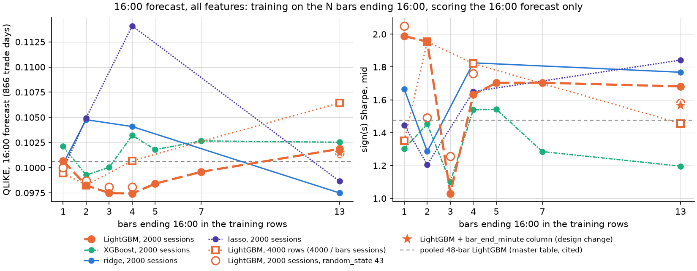

# Training the 16:00 trees on more bars than the last two (close study, 2026-10-04)

Question (the user's request): *run ablations on training on more bars than the last 2.* The data-size study trained LightGBM on both last-hour bars (2000 sessions = 4000 rows) and scored the 16:00 forecast only. This study trains on the N half-hour bars ending 16:00, N = 1, 2, 3, 4, 5, 7, 13, and again scores only the 16:00 forecast. Written by `experiments/close_trees_morebars.py analyze` from the CSVs in this folder; every number below is in them.

## Setup
- Design: `experiments/capture_design_close.py`, all features. N = 1 is the shipped one-bar design (`bar1600`), N = 2 is `last30`, N >= 3 is `lastbars<N>`. Each multi-bar design's rolling robust scaling uses its own window (2000 sessions x the median bars a session), so the 16:00 rows of two designs differ in the scaling of some columns; the target on the 16:00 rows is the same (asserted).
- Trees: the tree spec's shipped configs, refit every 10 sessions from forecast row 130 (2019-01), single-threaded, window mask on, one model forecasting the 16:00 row; the leaf minimum scaled to the training rows by the spec's rule (LightGBM `min_child_samples` = round(98 x rows / 24000), 98 at the pooled bank's 24000 rows). The model in force for the 16:00 row of day d was fitted on the design rows strictly before that row: the earlier bars of day d (targets realized by 15:30, when the forecast is issued) may enter it, nothing later does.
- Rows and sessions: *rows* = training rows of every fit; *sessions* = distinct sessions the training window touches at the refits (the forecast day's earlier bars count as one; half-day sessions hold fewer of the bars ending 16:00, so 2000 x N rows can span more than 2000 sessions).
- Rungs N = 1 and N = 2 are the data-size study's `lgbm_bar1600_w2000` and `lgbm_pool_w4000` (and its XGBoost / ridge / lasso arms of the same rows), reused after the gates below.
- Scorer: the master table's research convention (16:00 recalibration over the previous 250 sessions, the 15:30 sign(s) straddle trade), 866 trade days 2020-01-03 .. 2024-04-30, on the one-bar design's forecast rows. Point estimates (the block bootstrap is off); DM = Diebold-Mariano on daily QLIKE (negative = the arm has lower loss), HAC t = Newey-West t on the paired daily mid-fill P&L difference (positive = the arm earns more).

## Main ladder: LightGBM, 2000 sessions, N bars

| bars | rows | sessions | leaf min | QLIKE | Sharpe mid | Sharpe crossed | buys % | same position as 1 bar % | DM vs 1 bar | HAC t vs 1 bar | DM vs 2 bars | HAC t vs 2 bars | fit s (mean) | CPU min |
|---|---|---|---|---|---|---|---|---|---|---|---|---|---|---|
| 1 | 2000 | 2000 | 8 | 0.1007 | 1.99 | 1.52 | 38.7 | 100.0 |  |  | 1.16 | 0.13 | 9.9 | 21.3 |
| 2 | 4000 | 2001 | 16 | 0.0982 | 1.95 | 1.48 | 37.0 | 91.3 | -1.16 | -0.13 |  |  | 10.7 | 22.6 |
| 3 | 6000 | 2001 | 24 | 0.0975 | 1.03 | 0.55 | 33.9 | 89.5 | -1.14 | -2.25 | -0.51 | -2.05 | 7.3 | 16.1 |
| 4 | 8000 | 2001 | 33 | 0.0974 | 1.63 | 1.16 | 33.6 | 88.5 | -1.23 | -1.17 | -0.57 | -0.95 | 8.1 | 18.1 |
| 5 | 10000 | 2003..2004 | 41 | 0.0984 | 1.70 | 1.23 | 32.1 | 87.9 | -0.80 | -0.79 | 0.11 | -0.73 | 8.7 | 19.2 |
| 7 | 14000 | 2027..2047 | 57 | 0.0996 | 1.70 | 1.23 | 31.3 | 86.4 | -0.36 | -0.63 | 0.72 | -0.55 | 9.7 | 22.0 |
| 13 | 26000 | 2024..2028 | 106 | 0.1019 | 1.68 | 1.20 | 32.6 | 86.5 | 0.31 | -0.67 | 1.50 | -0.58 | 13.6 | 30.8 |
| pooled 48-bar LightGBM (master table `lgbm`, cited, not rerun) | 24000 bars | about 500 |  | 0.1006 | 1.48 | 0.99 |  |  |  |  |  |  |  |  |

## Reading (numbers from the tables in this file)
- LightGBM, 2000 sessions, QLIKE for N = 1 / 2 / 3 / 4 / 5 / 7 / 13: 0.1007 / 0.0982 / 0.0975 / 0.0974 / 0.0984 / 0.0996 / 0.1019; Sharpe mid 1.99 / 1.95 / 1.03 / 1.63 / 1.70 / 1.70 / 1.68.
- Lowest QLIKE on the ladder: N = 4 (8000 rows), 0.0974; against 1 bar DM -1.23 (p 0.218), against 2 bars DM -0.57 (p 0.570).
- N >= 3 against 2 bars: DM from -0.57 to 1.50, HAC t from -2.05 to -0.55; against 1 bar: DM from -1.23 to 0.31, HAC t from -2.25 to -0.63.
- Ladder rungs with |DM| >= 1.96 against the 1-bar or the 2-bar arm: none.
- Rows held at 4000 (LightGBM, leaf minimum 16), N = 1 / 2 / 4 / 13 (sessions 4000 / 2001 / 1001 / 311): QLIKE 0.0995 / 0.0982 / 0.1007 / 0.1064; Sharpe mid 1.35 / 1.95 / 1.82 / 1.46; against the 2-bar arm (4000 rows): N = 1 DM 0.56, HAC t -1.44; N = 4 DM 1.28, HAC t -0.41; N = 13 DM 2.98, HAC t -1.07.
- N = 13 with the added column `bar_end_minute` (design change) vs without: QLIKE 0.1019 -> 0.1015 (DM -0.91), Sharpe mid 1.68 -> 1.57 (HAC t -0.66).
- Seed replicate, LightGBM random_state 42 -> 43 (nothing else changed): N = 1: QLIKE 0.1007 -> 0.1000 (DM -0.77), Sharpe mid 1.99 -> 2.05 (HAC t 0.19); N = 2: QLIKE 0.0982 -> 0.0987 (DM 0.48), Sharpe mid 1.95 -> 1.49 (HAC t -2.06); N = 3: QLIKE 0.0975 -> 0.0981 (DM 0.86), Sharpe mid 1.03 -> 1.26 (HAC t 1.04); N = 4: QLIKE 0.0974 -> 0.0981 (DM 1.00), Sharpe mid 1.63 -> 1.76 (HAC t 0.60); N = 13: QLIKE 0.1019 -> 0.1014 (DM -0.95), Sharpe mid 1.68 -> 1.58 (HAC t -0.45).
- XGBoost, 2000 sessions, QLIKE for N = 1 / 2 / 3 / 4 / 5 / 7 / 13: 0.1021 / 0.0993 / 0.1000 / 0.1032 / 0.1018 / 0.1027 / 0.1025; Sharpe mid 1.30 / 1.45 / 1.10 / 1.54 / 1.54 / 1.28 / 1.20; against its own 1-bar arm DM ref / -1.93 / -0.81 / 0.43 / -0.13 / 0.20 / 0.14, HAC t ref / 0.52 / -0.50 / 0.58 / 0.75 / -0.05 / -0.31; against its own 2-bar arm DM 1.93 / ref / 0.49 / 2.29 / 1.53 / 1.84 / 1.52, HAC t -0.52 / ref / -0.81 / 0.26 / 0.25 / -0.42 / -0.68.
- ridge, 2000 sessions, QLIKE for N = 1 / 2 / 4 / 13: 0.1004 / 0.1048 / 0.1041 / 0.0975; Sharpe mid 1.66 / 1.29 / 1.83 / 1.77; against its own 1-bar arm DM ref / 1.40 / 1.09 / -0.92, HAC t ref / -0.98 / 0.33 / 0.23; against its own 2-bar arm DM -1.40 / ref / -0.23 / -2.42, HAC t 0.98 / ref / 1.38 / 1.17.
- lasso, 2000 sessions, QLIKE for N = 1 / 2 / 4 / 13: 0.0998 / 0.1049 / 0.1141 / 0.0987; Sharpe mid 1.45 / 1.21 / 1.65 / 1.84; against its own 1-bar arm DM ref / 1.37 / 1.37 / -0.35, HAC t ref / -0.68 / 0.63 / 1.06; against its own 2-bar arm DM -1.37 / ref / 0.86 / -2.23, HAC t 0.68 / ref / 1.40 / 1.57.
- Same rows, ridge minus LightGBM, QLIKE: N = 1 -0.0003 (DM -0.07); N = 2 +0.0065 (DM 1.50); N = 4 +0.0067 (DM 1.81); N = 13 -0.0044 (DM -1.24).
- Same rows, lasso minus LightGBM, QLIKE: N = 1 -0.0009 (DM -0.28); N = 2 +0.0067 (DM 1.66); N = 4 +0.0167 (DM 1.61); N = 13 -0.0032 (DM -1.00).
- Far end, cited: the paper's pooled 48-bar LightGBM (master-table row, same scorer; a 24000-bar window, about 500 sessions of 48 bars, on its own design) QLIKE 0.1006, Sharpe mid 1.48; 1-bar control 0.1007 / 1.99, 2 bars 0.0982 / 1.95.

## Other arms

| arm | model | bars | rows | sessions | training rows | QLIKE | Sharpe mid | Sharpe crossed | DM vs 1 bar | HAC t vs 1 bar | DM vs 2 bars | HAC t vs 2 bars | fit s (mean) | CPU min |
|---|---|---|---|---|---|---|---|---|---|---|---|---|---|---|
| `lgbm_bars1_r4000` | LightGBM | 1 | 4000 | 4000 | 16:00 rows of the lastbars13 design | 0.0995 | 1.35 | 0.88 | -0.83 | -1.52 | 0.56 | -1.44 | 7.0 | 15.4 |
| `lgbm_bars4_r4000` | LightGBM | 4 | 4000 | 1001 | 4 bars ending 16:00 (lastbars4) | 0.1007 | 1.82 | 1.35 | 0.00 | -0.52 | 1.28 | -0.41 | 6.7 | 14.8 |
| `lgbm_bars13_r4000` | LightGBM | 13 | 4000 | 311..313 | 13 bars ending 16:00 (lastbars13) | 0.1064 | 1.46 | 0.98 | 1.90 | -1.20 | 2.98 | -1.07 | 6.5 | 14.3 |
| `lgbm_bars13_r26000_barmin` | LightGBM | 13 | 26000 | 2024..2028 | 13 bars ending 16:00 (lastbars13) + column bar_end_minute (design change) | 0.1015 | 1.57 | 1.09 | 0.20 | -0.95 | 1.29 | -0.83 | 13.3 | 29.8 |
| `lgbm_bars1_r2000_seed43` | LightGBM | 1 | 2000 | 2000 | one-bar design (shipped), random_state 43 (seed replicate) | 0.1000 | 2.05 | 1.58 | -0.77 | 0.19 | 0.86 | 0.30 | 6.1 | 13.5 |
| `lgbm_bars2_r4000_seed43` | LightGBM | 2 | 4000 | 2001 | 2 bars ending 16:00 (last30), random_state 43 (seed replicate) | 0.0987 | 1.49 | 1.02 | -0.97 | -1.46 | 0.48 | -2.06 | 6.5 | 14.5 |
| `lgbm_bars3_r6000_seed43` | LightGBM | 3 | 6000 | 2001 | 3 bars ending 16:00 (lastbars3), random_state 43 (seed replicate) | 0.0981 | 1.26 | 0.78 | -0.94 | -1.64 | -0.12 | -1.53 | 7.2 | 16.0 |
| `lgbm_bars4_r8000_seed43` | LightGBM | 4 | 8000 | 2001 | 4 bars ending 16:00 (lastbars4), random_state 43 (seed replicate) | 0.0981 | 1.76 | 1.29 | -0.95 | -0.64 | -0.10 | -0.53 | 7.8 | 17.6 |
| `lgbm_bars13_r26000_seed43` | LightGBM | 13 | 26000 | 2024..2028 | 13 bars ending 16:00 (lastbars13), random_state 43 (seed replicate) | 0.1014 | 1.58 | 1.10 | 0.20 | -0.85 | 1.38 | -0.77 | 13.3 | 30.1 |
| `xgb_bars1_r2000` | XGBoost | 1 | 2000 | 2000 | one-bar design (shipped) | 0.1021 | 1.30 | 0.83 | 0.86 | -1.89 | 1.97 | -1.68 | 6.7 | 14.8 |
| `xgb_bars2_r4000` | XGBoost | 2 | 4000 | 2001 | 2 bars ending 16:00 (last30) | 0.0993 | 1.45 | 0.98 | -0.63 | -1.83 | 0.87 | -1.92 | 8.1 | 17.9 |
| `xgb_bars3_r6000` | XGBoost | 3 | 6000 | 2001 | 3 bars ending 16:00 (lastbars3) | 0.1000 | 1.10 | 0.62 | -0.21 | -1.96 | 0.95 | -1.81 | 5.5 | 12.1 |
| `xgb_bars4_r8000` | XGBoost | 4 | 8000 | 2001 | 4 bars ending 16:00 (lastbars4) | 0.1032 | 1.54 | 1.07 | 0.81 | -1.21 | 2.23 | -1.07 | 6.0 | 13.5 |
| `xgb_bars5_r10000` | XGBoost | 5 | 10000 | 2003..2004 | 5 bars ending 16:00 (lastbars5) | 0.1018 | 1.54 | 1.06 | 0.36 | -1.03 | 1.73 | -0.99 | 6.6 | 14.7 |
| `xgb_bars7_r14000` | XGBoost | 7 | 14000 | 2027..2047 | 7 bars ending 16:00 (lastbars7) | 0.1027 | 1.28 | 0.81 | 0.61 | -1.53 | 2.02 | -1.46 | 7.8 | 17.7 |
| `xgb_bars13_r26000` | XGBoost | 13 | 26000 | 2024..2028 | 13 bars ending 16:00 (lastbars13) | 0.1025 | 1.20 | 0.72 | 0.52 | -1.83 | 1.77 | -1.82 | 11.6 | 26.3 |
| `ridge_bars1_r2000` | ridge | 1 | 2000 | 2000 | one-bar design (shipped) | 0.1004 | 1.66 | 1.20 | -0.07 | -0.79 | 0.52 | -0.68 |  | 0.1 |
| `ridge_bars2_r4000` | ridge | 2 | 4000 | 2001 | 2 bars ending 16:00 (last30) | 0.1048 | 1.29 | 0.82 | 0.88 | -1.46 | 1.50 | -1.55 |  | 0.2 |
| `ridge_bars4_r8000` | ridge | 4 | 8000 | 2001 | 4 bars ending 16:00 (lastbars4) | 0.1041 | 1.83 | 1.36 | 0.80 | -0.32 | 1.67 | -0.27 |  | 1.0 |
| `ridge_bars13_r26000` | ridge | 13 | 26000 | 2024..2028 | 13 bars ending 16:00 (lastbars13) | 0.0975 | 1.77 | 1.29 | -0.75 | -0.53 | -0.22 | -0.49 |  | 8.2 |
| `lasso_bars1_r2000` | lasso | 1 | 2000 | 2000 | one-bar design (shipped) | 0.0998 | 1.45 | 0.98 | -0.28 | -1.46 | 0.61 | -1.48 |  | 1.3 |
| `lasso_bars2_r4000` | lasso | 2 | 4000 | 2001 | 2 bars ending 16:00 (last30) | 0.1049 | 1.21 | 0.74 | 0.96 | -2.09 | 1.66 | -1.93 |  | 3.1 |
| `lasso_bars4_r8000` | lasso | 4 | 8000 | 2001 | 4 bars ending 16:00 (lastbars4) | 0.1141 | 1.65 | 1.18 | 1.25 | -0.87 | 1.53 | -0.86 |  | 6.1 |
| `lasso_bars13_r26000` | lasso | 13 | 26000 | 2024..2028 | 13 bars ending 16:00 (lastbars13) | 0.0987 | 1.84 | 1.37 | -0.47 | -0.34 | 0.12 | -0.29 |  | 41.5 |

## Pairwise differences (`vs_reference.csv`)

| arm | reference | dQLIKE | dQLIKE % | DM | p | dSharpe mid | HAC t |
|---|---|---|---|---|---|---|---|
| `lgbm_bars1_r2000` | `lgbm_bars2_r4000` | +0.0024 | +2.5 | 1.16 | 0.247 | +0.03 | 0.13 |
| `lgbm_bars2_r4000` | `lgbm_bars1_r2000` | -0.0024 | -2.4 | -1.16 | 0.247 | -0.03 | -0.13 |
| `lgbm_bars3_r6000` | `lgbm_bars1_r2000` | -0.0032 | -3.2 | -1.14 | 0.254 | -0.96 | -2.25 |
| `lgbm_bars3_r6000` | `lgbm_bars2_r4000` | -0.0008 | -0.8 | -0.51 | 0.609 | -0.92 | -2.05 |
| `lgbm_bars4_r8000` | `lgbm_bars1_r2000` | -0.0032 | -3.2 | -1.23 | 0.218 | -0.36 | -1.17 |
| `lgbm_bars4_r8000` | `lgbm_bars2_r4000` | -0.0008 | -0.8 | -0.57 | 0.570 | -0.32 | -0.95 |
| `lgbm_bars5_r10000` | `lgbm_bars1_r2000` | -0.0023 | -2.2 | -0.80 | 0.423 | -0.29 | -0.79 |
| `lgbm_bars5_r10000` | `lgbm_bars2_r4000` | +0.0002 | +0.2 | 0.11 | 0.915 | -0.25 | -0.73 |
| `lgbm_bars7_r14000` | `lgbm_bars1_r2000` | -0.0011 | -1.1 | -0.36 | 0.720 | -0.28 | -0.63 |
| `lgbm_bars7_r14000` | `lgbm_bars2_r4000` | +0.0013 | +1.4 | 0.72 | 0.472 | -0.25 | -0.55 |
| `lgbm_bars13_r26000` | `lgbm_bars1_r2000` | +0.0012 | +1.2 | 0.31 | 0.753 | -0.31 | -0.67 |
| `lgbm_bars13_r26000` | `lgbm_bars2_r4000` | +0.0036 | +3.7 | 1.50 | 0.135 | -0.27 | -0.58 |
| `lgbm_bars1_r4000` | `lgbm_bars1_r2000` | -0.0012 | -1.2 | -0.83 | 0.405 | -0.64 | -1.52 |
| `lgbm_bars1_r4000` | `lgbm_bars2_r4000` | +0.0012 | +1.2 | 0.56 | 0.572 | -0.60 | -1.44 |
| `lgbm_bars4_r4000` | `lgbm_bars1_r2000` | +0.0000 | +0.0 | 0.00 | 0.996 | -0.17 | -0.52 |
| `lgbm_bars4_r4000` | `lgbm_bars2_r4000` | +0.0024 | +2.5 | 1.28 | 0.202 | -0.13 | -0.41 |
| `lgbm_bars4_r4000` | `lgbm_bars4_r8000` | +0.0033 | +3.3 | 2.20 | 0.028 | +0.19 | 0.76 |
| `lgbm_bars13_r4000` | `lgbm_bars1_r2000` | +0.0058 | +5.7 | 1.90 | 0.058 | -0.53 | -1.20 |
| `lgbm_bars13_r4000` | `lgbm_bars2_r4000` | +0.0082 | +8.3 | 2.98 | 0.003 | -0.50 | -1.07 |
| `lgbm_bars13_r4000` | `lgbm_bars13_r26000` | +0.0046 | +4.5 | 1.60 | 0.111 | -0.23 | -0.49 |
| `lgbm_bars13_r26000_barmin` | `lgbm_bars1_r2000` | +0.0008 | +0.8 | 0.20 | 0.838 | -0.42 | -0.95 |
| `lgbm_bars13_r26000_barmin` | `lgbm_bars2_r4000` | +0.0032 | +3.3 | 1.29 | 0.197 | -0.39 | -0.83 |
| `lgbm_bars13_r26000_barmin` | `lgbm_bars13_r26000` | -0.0004 | -0.4 | -0.91 | 0.363 | -0.12 | -0.66 |
| `lgbm_bars1_r2000_seed43` | `lgbm_bars1_r2000` | -0.0007 | -0.7 | -0.77 | 0.443 | +0.06 | 0.19 |
| `lgbm_bars1_r2000_seed43` | `lgbm_bars2_r4000` | +0.0017 | +1.8 | 0.86 | 0.388 | +0.10 | 0.30 |
| `lgbm_bars2_r4000_seed43` | `lgbm_bars1_r2000` | -0.0020 | -2.0 | -0.97 | 0.333 | -0.50 | -1.46 |
| `lgbm_bars2_r4000_seed43` | `lgbm_bars2_r4000` | +0.0004 | +0.5 | 0.48 | 0.634 | -0.46 | -2.06 |
| `lgbm_bars3_r6000_seed43` | `lgbm_bars1_r2000` | -0.0026 | -2.6 | -0.94 | 0.347 | -0.73 | -1.64 |
| `lgbm_bars3_r6000_seed43` | `lgbm_bars2_r4000` | -0.0002 | -0.2 | -0.12 | 0.902 | -0.70 | -1.53 |
| `lgbm_bars3_r6000_seed43` | `lgbm_bars3_r6000` | +0.0006 | +0.6 | 0.86 | 0.390 | +0.23 | 1.04 |
| `lgbm_bars4_r8000_seed43` | `lgbm_bars1_r2000` | -0.0026 | -2.6 | -0.95 | 0.342 | -0.23 | -0.64 |
| `lgbm_bars4_r8000_seed43` | `lgbm_bars2_r4000` | -0.0001 | -0.1 | -0.10 | 0.919 | -0.19 | -0.53 |
| `lgbm_bars4_r8000_seed43` | `lgbm_bars4_r8000` | +0.0007 | +0.7 | 1.00 | 0.318 | +0.13 | 0.60 |
| `lgbm_bars13_r26000_seed43` | `lgbm_bars1_r2000` | +0.0008 | +0.7 | 0.20 | 0.839 | -0.41 | -0.85 |
| `lgbm_bars13_r26000_seed43` | `lgbm_bars2_r4000` | +0.0032 | +3.2 | 1.38 | 0.169 | -0.37 | -0.77 |
| `lgbm_bars13_r26000_seed43` | `lgbm_bars13_r26000` | -0.0004 | -0.4 | -0.95 | 0.343 | -0.10 | -0.45 |
| `xgb_bars1_r2000` | `lgbm_bars1_r2000` | +0.0014 | +1.4 | 0.86 | 0.389 | -0.69 | -1.89 |
| `xgb_bars1_r2000` | `lgbm_bars2_r4000` | +0.0039 | +3.9 | 1.97 | 0.048 | -0.65 | -1.68 |
| `xgb_bars1_r2000` | `xgb_bars2_r4000` | +0.0028 | +2.9 | 1.93 | 0.054 | -0.15 | -0.52 |
| `xgb_bars2_r4000` | `lgbm_bars1_r2000` | -0.0014 | -1.4 | -0.63 | 0.529 | -0.54 | -1.83 |
| `xgb_bars2_r4000` | `lgbm_bars2_r4000` | +0.0010 | +1.0 | 0.87 | 0.387 | -0.50 | -1.92 |
| `xgb_bars2_r4000` | `xgb_bars1_r2000` | -0.0028 | -2.8 | -1.93 | 0.054 | +0.15 | 0.52 |
| `xgb_bars3_r6000` | `lgbm_bars1_r2000` | -0.0006 | -0.6 | -0.21 | 0.835 | -0.89 | -1.96 |
| `xgb_bars3_r6000` | `lgbm_bars2_r4000` | +0.0018 | +1.8 | 0.95 | 0.342 | -0.85 | -1.81 |
| `xgb_bars3_r6000` | `xgb_bars1_r2000` | -0.0021 | -2.0 | -0.81 | 0.417 | -0.20 | -0.50 |
| `xgb_bars3_r6000` | `xgb_bars2_r4000` | +0.0008 | +0.8 | 0.49 | 0.627 | -0.35 | -0.81 |
| `xgb_bars4_r8000` | `lgbm_bars1_r2000` | +0.0025 | +2.5 | 0.81 | 0.417 | -0.45 | -1.21 |
| `xgb_bars4_r8000` | `lgbm_bars2_r4000` | +0.0050 | +5.0 | 2.23 | 0.026 | -0.41 | -1.07 |
| `xgb_bars4_r8000` | `xgb_bars1_r2000` | +0.0011 | +1.1 | 0.43 | 0.667 | +0.24 | 0.58 |
| `xgb_bars4_r8000` | `xgb_bars2_r4000` | +0.0039 | +4.0 | 2.29 | 0.022 | +0.09 | 0.26 |
| `xgb_bars5_r10000` | `lgbm_bars1_r2000` | +0.0011 | +1.1 | 0.36 | 0.718 | -0.45 | -1.03 |
| `xgb_bars5_r10000` | `lgbm_bars2_r4000` | +0.0035 | +3.6 | 1.73 | 0.083 | -0.41 | -0.99 |
| `xgb_bars5_r10000` | `xgb_bars1_r2000` | -0.0003 | -0.3 | -0.13 | 0.899 | +0.24 | 0.75 |
| `xgb_bars5_r10000` | `xgb_bars2_r4000` | +0.0025 | +2.5 | 1.53 | 0.126 | +0.09 | 0.25 |
| `xgb_bars7_r14000` | `lgbm_bars1_r2000` | +0.0020 | +2.0 | 0.61 | 0.541 | -0.70 | -1.53 |
| `xgb_bars7_r14000` | `lgbm_bars2_r4000` | +0.0044 | +4.5 | 2.02 | 0.044 | -0.67 | -1.46 |
| `xgb_bars7_r14000` | `xgb_bars1_r2000` | +0.0005 | +0.5 | 0.20 | 0.841 | -0.02 | -0.05 |
| `xgb_bars7_r14000` | `xgb_bars2_r4000` | +0.0034 | +3.4 | 1.84 | 0.065 | -0.17 | -0.42 |
| `xgb_bars13_r26000` | `lgbm_bars1_r2000` | +0.0019 | +1.8 | 0.52 | 0.602 | -0.79 | -1.83 |
| `xgb_bars13_r26000` | `lgbm_bars2_r4000` | +0.0043 | +4.4 | 1.77 | 0.076 | -0.76 | -1.82 |
| `xgb_bars13_r26000` | `xgb_bars1_r2000` | +0.0004 | +0.4 | 0.14 | 0.889 | -0.11 | -0.31 |
| `xgb_bars13_r26000` | `xgb_bars2_r4000` | +0.0033 | +3.3 | 1.52 | 0.128 | -0.26 | -0.68 |
| `ridge_bars1_r2000` | `lgbm_bars1_r2000` | -0.0003 | -0.3 | -0.07 | 0.942 | -0.32 | -0.79 |
| `ridge_bars1_r2000` | `lgbm_bars2_r4000` | +0.0021 | +2.2 | 0.52 | 0.601 | -0.29 | -0.68 |
| `ridge_bars1_r2000` | `ridge_bars2_r4000` | -0.0044 | -4.2 | -1.40 | 0.163 | +0.38 | 0.98 |
| `ridge_bars2_r4000` | `lgbm_bars1_r2000` | +0.0041 | +4.1 | 0.88 | 0.379 | -0.70 | -1.46 |
| `ridge_bars2_r4000` | `lgbm_bars2_r4000` | +0.0065 | +6.6 | 1.50 | 0.134 | -0.67 | -1.55 |
| `ridge_bars2_r4000` | `ridge_bars1_r2000` | +0.0044 | +4.4 | 1.40 | 0.163 | -0.38 | -0.98 |
| `ridge_bars4_r8000` | `lgbm_bars1_r2000` | +0.0034 | +3.4 | 0.80 | 0.426 | -0.16 | -0.32 |
| `ridge_bars4_r8000` | `lgbm_bars2_r4000` | +0.0058 | +5.9 | 1.67 | 0.095 | -0.13 | -0.27 |
| `ridge_bars4_r8000` | `ridge_bars1_r2000` | +0.0037 | +3.7 | 1.09 | 0.275 | +0.16 | 0.33 |
| `ridge_bars4_r8000` | `ridge_bars2_r4000` | -0.0007 | -0.7 | -0.23 | 0.818 | +0.54 | 1.38 |
| `ridge_bars4_r8000` | `lgbm_bars4_r8000` | +0.0067 | +6.8 | 1.81 | 0.071 | +0.19 | 0.46 |
| `ridge_bars13_r26000` | `lgbm_bars1_r2000` | -0.0032 | -3.2 | -0.75 | 0.455 | -0.22 | -0.53 |
| `ridge_bars13_r26000` | `lgbm_bars2_r4000` | -0.0008 | -0.8 | -0.22 | 0.829 | -0.19 | -0.49 |
| `ridge_bars13_r26000` | `ridge_bars1_r2000` | -0.0029 | -2.9 | -0.92 | 0.356 | +0.10 | 0.23 |
| `ridge_bars13_r26000` | `ridge_bars2_r4000` | -0.0073 | -6.9 | -2.42 | 0.016 | +0.48 | 1.17 |
| `ridge_bars13_r26000` | `lgbm_bars13_r26000` | -0.0044 | -4.3 | -1.24 | 0.217 | +0.09 | 0.19 |
| `lasso_bars1_r2000` | `lgbm_bars1_r2000` | -0.0009 | -0.9 | -0.28 | 0.780 | -0.54 | -1.46 |
| `lasso_bars1_r2000` | `lgbm_bars2_r4000` | +0.0015 | +1.5 | 0.61 | 0.539 | -0.51 | -1.48 |
| `lasso_bars1_r2000` | `lasso_bars2_r4000` | -0.0052 | -4.9 | -1.37 | 0.171 | +0.24 | 0.68 |
| `lasso_bars2_r4000` | `lgbm_bars1_r2000` | +0.0043 | +4.2 | 0.96 | 0.339 | -0.78 | -2.09 |
| `lasso_bars2_r4000` | `lgbm_bars2_r4000` | +0.0067 | +6.8 | 1.66 | 0.097 | -0.75 | -1.93 |
| `lasso_bars2_r4000` | `lasso_bars1_r2000` | +0.0052 | +5.2 | 1.37 | 0.171 | -0.24 | -0.68 |
| `lasso_bars4_r8000` | `lgbm_bars1_r2000` | +0.0134 | +13.3 | 1.25 | 0.213 | -0.34 | -0.87 |
| `lasso_bars4_r8000` | `lgbm_bars2_r4000` | +0.0158 | +16.1 | 1.53 | 0.127 | -0.30 | -0.86 |
| `lasso_bars4_r8000` | `lasso_bars1_r2000` | +0.0143 | +14.4 | 1.37 | 0.170 | +0.20 | 0.63 |
| `lasso_bars4_r8000` | `lasso_bars2_r4000` | +0.0091 | +8.7 | 0.86 | 0.388 | +0.45 | 1.40 |
| `lasso_bars4_r8000` | `lgbm_bars4_r8000` | +0.0167 | +17.1 | 1.61 | 0.108 | +0.02 | 0.05 |
| `lasso_bars13_r26000` | `lgbm_bars1_r2000` | -0.0020 | -2.0 | -0.47 | 0.639 | -0.15 | -0.34 |
| `lasso_bars13_r26000` | `lgbm_bars2_r4000` | +0.0004 | +0.4 | 0.12 | 0.904 | -0.11 | -0.29 |
| `lasso_bars13_r26000` | `lasso_bars1_r2000` | -0.0011 | -1.1 | -0.35 | 0.726 | +0.40 | 1.06 |
| `lasso_bars13_r26000` | `lasso_bars2_r4000` | -0.0063 | -6.0 | -2.23 | 0.026 | +0.64 | 1.57 |
| `lasso_bars13_r26000` | `lgbm_bars13_r26000` | -0.0032 | -3.1 | -1.00 | 0.316 | +0.16 | 0.35 |

## Gates
- lgbm_bars1_r2000 = data-size lgbm_bar1600_w2000: QLIKE re-scored here = its arms.csv: 0.100676 vs 0.100676 (|diff| 4.16e-17) PASS
- lgbm_bars1_r2000 = data-size lgbm_bar1600_w2000: Sharpe mid re-scored here = its arms.csv: 1.98862 vs 1.98862 (|diff| 0.00e+00) PASS
- lgbm_bars1_r2000 = data-size lgbm_bar1600_w2000: configuration, bucket (all_features): 1 vs 1 (|diff| 0.00e+00) PASS
- lgbm_bars1_r2000 = data-size lgbm_bar1600_w2000: configuration, model (lgbm): 1 vs 1 (|diff| 0.00e+00) PASS
- lgbm_bars1_r2000 = data-size lgbm_bar1600_w2000: configuration, window rows (2000): 1 vs 1 (|diff| 0.00e+00) PASS
- lgbm_bars1_r2000 = data-size lgbm_bar1600_w2000: configuration, rows (source) (bar1600): 1 vs 1 (|diff| 0.00e+00) PASS
- lgbm_bars1_r2000 = data-size lgbm_bar1600_w2000: configuration, whole arm (no chunk / slice) (chunk 'absent', slice absent): 1 vs 1 (|diff| 0.00e+00) PASS
- lgbm_bars1_r2000 = data-size lgbm_bar1600_w2000: configuration, params = spec rule at these rows (leaf minimum 8): 1 vs 1 (|diff| 0.00e+00) PASS
- lgbm_bars1_r2000 = data-size lgbm_bar1600_w2000: configuration, refit every 10, first forecast row 130 (10 130): 1 vs 1 (|diff| 0.00e+00) PASS
- lgbm_bars1_r2000 = data-size lgbm_bar1600_w2000: configuration, refit anchors (134): 1 vs 1 (|diff| 0.00e+00) PASS
- lgbm_bars1_r2000 = data-size lgbm_bar1600_w2000: configuration, training rows at every refit ([2000]): 1 vs 1 (|diff| 0.00e+00) PASS
- lgbm_bars2_r4000 = data-size lgbm_pool_w4000: QLIKE re-scored here = its arms.csv: 0.0982494 vs 0.0982494 (|diff| 5.55e-17) PASS
- lgbm_bars2_r4000 = data-size lgbm_pool_w4000: Sharpe mid re-scored here = its arms.csv: 1.95432 vs 1.95432 (|diff| 2.22e-16) PASS
- lgbm_bars2_r4000 = data-size lgbm_pool_w4000: configuration, bucket (all_features): 1 vs 1 (|diff| 0.00e+00) PASS
- lgbm_bars2_r4000 = data-size lgbm_pool_w4000: configuration, model (lgbm): 1 vs 1 (|diff| 0.00e+00) PASS
- lgbm_bars2_r4000 = data-size lgbm_pool_w4000: configuration, window rows (4000): 1 vs 1 (|diff| 0.00e+00) PASS
- lgbm_bars2_r4000 = data-size lgbm_pool_w4000: configuration, rows (source) (pool): 1 vs 1 (|diff| 0.00e+00) PASS
- lgbm_bars2_r4000 = data-size lgbm_pool_w4000: configuration, whole arm (no chunk / slice) (chunk 'absent', slice absent): 1 vs 1 (|diff| 0.00e+00) PASS
- lgbm_bars2_r4000 = data-size lgbm_pool_w4000: configuration, params = spec rule at these rows (leaf minimum 16): 1 vs 1 (|diff| 0.00e+00) PASS
- lgbm_bars2_r4000 = data-size lgbm_pool_w4000: configuration, refit every 10, first forecast row 130 (10 130): 1 vs 1 (|diff| 0.00e+00) PASS
- lgbm_bars2_r4000 = data-size lgbm_pool_w4000: configuration, refit anchors (134): 1 vs 1 (|diff| 0.00e+00) PASS
- lgbm_bars2_r4000 = data-size lgbm_pool_w4000: configuration, training rows at every refit ([4000]): 1 vs 1 (|diff| 0.00e+00) PASS
- xgb_bars1_r2000 = data-size xgb_bar1600_w2000: QLIKE re-scored here = its arms.csv: 0.102116 vs 0.102116 (|diff| 5.55e-17) PASS
- xgb_bars1_r2000 = data-size xgb_bar1600_w2000: Sharpe mid re-scored here = its arms.csv: 1.3026 vs 1.3026 (|diff| 0.00e+00) PASS
- xgb_bars1_r2000 = data-size xgb_bar1600_w2000: configuration, bucket (all_features): 1 vs 1 (|diff| 0.00e+00) PASS
- xgb_bars1_r2000 = data-size xgb_bar1600_w2000: configuration, model (xgb): 1 vs 1 (|diff| 0.00e+00) PASS
- xgb_bars1_r2000 = data-size xgb_bar1600_w2000: configuration, window rows (2000): 1 vs 1 (|diff| 0.00e+00) PASS
- xgb_bars1_r2000 = data-size xgb_bar1600_w2000: configuration, rows (source) (bar1600): 1 vs 1 (|diff| 0.00e+00) PASS
- xgb_bars1_r2000 = data-size xgb_bar1600_w2000: configuration, whole arm (no chunk / slice) (chunk '', slice 0): 1 vs 1 (|diff| 0.00e+00) PASS
- xgb_bars1_r2000 = data-size xgb_bar1600_w2000: configuration, params = spec rule at these rows (leaf minimum 2.072): 1 vs 1 (|diff| 0.00e+00) PASS
- xgb_bars1_r2000 = data-size xgb_bar1600_w2000: configuration, refit every 10, first forecast row 130 (10 130): 1 vs 1 (|diff| 0.00e+00) PASS
- xgb_bars1_r2000 = data-size xgb_bar1600_w2000: configuration, refit anchors (134): 1 vs 1 (|diff| 0.00e+00) PASS
- xgb_bars1_r2000 = data-size xgb_bar1600_w2000: configuration, training rows at every refit ([2000]): 1 vs 1 (|diff| 0.00e+00) PASS
- xgb_bars2_r4000 = data-size xgb_pool_w4000: QLIKE re-scored here = its arms.csv: 0.0992749 vs 0.0992749 (|diff| 2.78e-17) PASS
- xgb_bars2_r4000 = data-size xgb_pool_w4000: Sharpe mid re-scored here = its arms.csv: 1.45218 vs 1.45218 (|diff| 0.00e+00) PASS
- xgb_bars2_r4000 = data-size xgb_pool_w4000: configuration, bucket (all_features): 1 vs 1 (|diff| 0.00e+00) PASS
- xgb_bars2_r4000 = data-size xgb_pool_w4000: configuration, model (xgb): 1 vs 1 (|diff| 0.00e+00) PASS
- xgb_bars2_r4000 = data-size xgb_pool_w4000: configuration, window rows (4000): 1 vs 1 (|diff| 0.00e+00) PASS
- xgb_bars2_r4000 = data-size xgb_pool_w4000: configuration, rows (source) (pool): 1 vs 1 (|diff| 0.00e+00) PASS
- xgb_bars2_r4000 = data-size xgb_pool_w4000: configuration, whole arm (no chunk / slice) (chunk '', slice 0): 1 vs 1 (|diff| 0.00e+00) PASS
- xgb_bars2_r4000 = data-size xgb_pool_w4000: configuration, params = spec rule at these rows (leaf minimum 4.144): 1 vs 1 (|diff| 0.00e+00) PASS
- xgb_bars2_r4000 = data-size xgb_pool_w4000: configuration, refit every 10, first forecast row 130 (10 130): 1 vs 1 (|diff| 0.00e+00) PASS
- xgb_bars2_r4000 = data-size xgb_pool_w4000: configuration, refit anchors (134): 1 vs 1 (|diff| 0.00e+00) PASS
- xgb_bars2_r4000 = data-size xgb_pool_w4000: configuration, training rows at every refit ([4000]): 1 vs 1 (|diff| 0.00e+00) PASS
- ridge_bars1_r2000 = data-size ridge_bar1600_w2000: QLIKE re-scored here = its arms.csv: 0.100387 vs 0.100387 (|diff| 2.78e-17) PASS
- ridge_bars1_r2000 = data-size ridge_bar1600_w2000: Sharpe mid re-scored here = its arms.csv: 1.66493 vs 1.66493 (|diff| 0.00e+00) PASS
- ridge_bars1_r2000 = data-size ridge_bar1600_w2000: configuration, bucket (all_features): 1 vs 1 (|diff| 0.00e+00) PASS
- ridge_bars1_r2000 = data-size ridge_bar1600_w2000: configuration, model (ridge): 1 vs 1 (|diff| 0.00e+00) PASS
- ridge_bars1_r2000 = data-size ridge_bar1600_w2000: configuration, window rows (2000): 1 vs 1 (|diff| 0.00e+00) PASS
- ridge_bars1_r2000 = data-size ridge_bar1600_w2000: configuration, rows (source) (bar1600): 1 vs 1 (|diff| 0.00e+00) PASS
- ridge_bars1_r2000 = data-size ridge_bar1600_w2000: configuration, whole arm (no chunk / slice) (chunk 'absent', slice absent): 1 vs 1 (|diff| 0.00e+00) PASS
- ridge_bars1_r2000 = data-size ridge_bar1600_w2000: configuration, estimator (ridge): 1 vs 1 (|diff| 0.00e+00) PASS
- ridge_bars2_r4000 = data-size ridge_pool_w4000: QLIKE re-scored here = its arms.csv: 0.104768 vs 0.104768 (|diff| 1.39e-17) PASS
- ridge_bars2_r4000 = data-size ridge_pool_w4000: Sharpe mid re-scored here = its arms.csv: 1.28576 vs 1.28576 (|diff| 0.00e+00) PASS
- ridge_bars2_r4000 = data-size ridge_pool_w4000: configuration, bucket (all_features): 1 vs 1 (|diff| 0.00e+00) PASS
- ridge_bars2_r4000 = data-size ridge_pool_w4000: configuration, model (ridge): 1 vs 1 (|diff| 0.00e+00) PASS
- ridge_bars2_r4000 = data-size ridge_pool_w4000: configuration, window rows (4000): 1 vs 1 (|diff| 0.00e+00) PASS
- ridge_bars2_r4000 = data-size ridge_pool_w4000: configuration, rows (source) (pool): 1 vs 1 (|diff| 0.00e+00) PASS
- ridge_bars2_r4000 = data-size ridge_pool_w4000: configuration, whole arm (no chunk / slice) (chunk 'absent', slice absent): 1 vs 1 (|diff| 0.00e+00) PASS
- ridge_bars2_r4000 = data-size ridge_pool_w4000: configuration, estimator (ridge): 1 vs 1 (|diff| 0.00e+00) PASS
- lasso_bars1_r2000 = data-size lasso_bar1600_w2000: QLIKE re-scored here = its arms.csv: 0.0997564 vs 0.0997564 (|diff| 2.78e-17) PASS
- lasso_bars1_r2000 = data-size lasso_bar1600_w2000: Sharpe mid re-scored here = its arms.csv: 1.44642 vs 1.44642 (|diff| 0.00e+00) PASS
- lasso_bars1_r2000 = data-size lasso_bar1600_w2000: configuration, bucket (all_features): 1 vs 1 (|diff| 0.00e+00) PASS
- lasso_bars1_r2000 = data-size lasso_bar1600_w2000: configuration, model (lasso): 1 vs 1 (|diff| 0.00e+00) PASS
- lasso_bars1_r2000 = data-size lasso_bar1600_w2000: configuration, window rows (2000): 1 vs 1 (|diff| 0.00e+00) PASS
- lasso_bars1_r2000 = data-size lasso_bar1600_w2000: configuration, rows (source) (bar1600): 1 vs 1 (|diff| 0.00e+00) PASS
- lasso_bars1_r2000 = data-size lasso_bar1600_w2000: configuration, whole arm (no chunk / slice) (chunk 'absent', slice absent): 1 vs 1 (|diff| 0.00e+00) PASS
- lasso_bars1_r2000 = data-size lasso_bar1600_w2000: configuration, estimator (reclasso): 1 vs 1 (|diff| 0.00e+00) PASS
- lasso_bars2_r4000 = data-size lasso_pool_w4000: QLIKE re-scored here = its arms.csv: 0.104947 vs 0.104947 (|diff| 1.39e-17) PASS
- lasso_bars2_r4000 = data-size lasso_pool_w4000: Sharpe mid re-scored here = its arms.csv: 1.20599 vs 1.20599 (|diff| 0.00e+00) PASS
- lasso_bars2_r4000 = data-size lasso_pool_w4000: configuration, bucket (all_features): 1 vs 1 (|diff| 0.00e+00) PASS
- lasso_bars2_r4000 = data-size lasso_pool_w4000: configuration, model (lasso): 1 vs 1 (|diff| 0.00e+00) PASS
- lasso_bars2_r4000 = data-size lasso_pool_w4000: configuration, window rows (4000): 1 vs 1 (|diff| 0.00e+00) PASS
- lasso_bars2_r4000 = data-size lasso_pool_w4000: configuration, rows (source) (pool): 1 vs 1 (|diff| 0.00e+00) PASS
- lasso_bars2_r4000 = data-size lasso_pool_w4000: configuration, whole arm (no chunk / slice) (chunk 'absent', slice absent): 1 vs 1 (|diff| 0.00e+00) PASS
- lasso_bars2_r4000 = data-size lasso_pool_w4000: configuration, estimator (reclasso): 1 vs 1 (|diff| 0.00e+00) PASS
- lgbm_bars1_r2000: rows built here = data-size rows (X, y, forecast rows): 1 vs 1 (|diff| 0.00e+00) PASS
- lgbm_bars1_r2000: first 3 refits redone here vs stored lgbm_bar1600_w2000 (30 forecasts), max |difference|: 0 vs 0 (|diff| 0.00e+00) PASS
- lgbm_bars2_r4000: rows built here = data-size rows (X, y, forecast rows): 1 vs 1 (|diff| 0.00e+00) PASS
- lgbm_bars2_r4000: first 3 refits redone here vs stored lgbm_pool_w4000 (30 forecasts), max |difference|: 0 vs 0 (|diff| 0.00e+00) PASS
- lgbm_bars3_r6000: calendar column `hour` takes values on the 16:00 rows that no other row has (lastbars3): 1 vs 1 (|diff| 0.00e+00) PASS
- lgbm_bars4_r8000: calendar column `hour` takes values on the 16:00 rows that no other row has (lastbars4): 1 vs 1 (|diff| 0.00e+00) PASS
- lgbm_bars5_r10000: calendar column `hour` takes values on the 16:00 rows that no other row has (lastbars5): 1 vs 1 (|diff| 0.00e+00) PASS
- lgbm_bars7_r14000: calendar column `hour` takes values on the 16:00 rows that no other row has (lastbars7): 1 vs 1 (|diff| 0.00e+00) PASS
- lgbm_bars13_r26000: calendar column `hour` takes values on the 16:00 rows that no other row has (lastbars13): 1 vs 1 (|diff| 0.00e+00) PASS
- xgb_bars3_r6000: calendar column `hour` takes values on the 16:00 rows that no other row has (lastbars3): 1 vs 1 (|diff| 0.00e+00) PASS
- xgb_bars4_r8000: calendar column `hour` takes values on the 16:00 rows that no other row has (lastbars4): 1 vs 1 (|diff| 0.00e+00) PASS
- xgb_bars5_r10000: calendar column `hour` takes values on the 16:00 rows that no other row has (lastbars5): 1 vs 1 (|diff| 0.00e+00) PASS
- xgb_bars7_r14000: calendar column `hour` takes values on the 16:00 rows that no other row has (lastbars7): 1 vs 1 (|diff| 0.00e+00) PASS
- xgb_bars13_r26000: calendar column `hour` takes values on the 16:00 rows that no other row has (lastbars13): 1 vs 1 (|diff| 0.00e+00) PASS
- ridge_bars4_r8000: calendar column `hour` takes values on the 16:00 rows that no other row has (lastbars4): 1 vs 1 (|diff| 0.00e+00) PASS
- ridge_bars13_r26000: calendar column `hour` takes values on the 16:00 rows that no other row has (lastbars13): 1 vs 1 (|diff| 0.00e+00) PASS
- lasso_bars4_r8000: calendar column `hour` takes values on the 16:00 rows that no other row has (lastbars4): 1 vs 1 (|diff| 0.00e+00) PASS
- lasso_bars13_r26000: calendar column `hour` takes values on the 16:00 rows that no other row has (lastbars13): 1 vs 1 (|diff| 0.00e+00) PASS
- lgbm_bars4_r4000: calendar column `hour` takes values on the 16:00 rows that no other row has (lastbars4): 1 vs 1 (|diff| 0.00e+00) PASS
- lgbm_bars13_r4000: calendar column `hour` takes values on the 16:00 rows that no other row has (lastbars13): 1 vs 1 (|diff| 0.00e+00) PASS
- lgbm_bars13_r26000_barmin: calendar column `hour` takes values on the 16:00 rows that no other row has (lastbars13): 1 vs 1 (|diff| 0.00e+00) PASS
- lgbm_bars2_r4000_seed43: calendar column `hour` takes values on the 16:00 rows that no other row has (last30): 1 vs 1 (|diff| 0.00e+00) PASS
- lgbm_bars3_r6000_seed43: calendar column `hour` takes values on the 16:00 rows that no other row has (lastbars3): 1 vs 1 (|diff| 0.00e+00) PASS
- lgbm_bars4_r8000_seed43: calendar column `hour` takes values on the 16:00 rows that no other row has (lastbars4): 1 vs 1 (|diff| 0.00e+00) PASS
- lgbm_bars13_r26000_seed43: calendar column `hour` takes values on the 16:00 rows that no other row has (lastbars13): 1 vs 1 (|diff| 0.00e+00) PASS

## Caveats
- The leaf minimum changes with the rows (the spec's rule), so each rung changes the rows, the bars and the leaf minimum together; the rows-held-at-4000 arms hold the rows and the leaf minimum (16) fixed.
- Each design has its own rolling scaling, so two rungs differ also in the scaling of some columns; in the data-size study the same LightGBM on two scalings of the same 16:00 rows gave QLIKE 0.1007 vs 0.1006 and Sharpe mid 1.99 vs 1.56.
- Linear arms solve at every row (the earlier bars included, not scored) and re-choose the penalty every 250 solves on the window's last 125 rows (the spec's constants, in rows), i.e. every 250 / N sessions on about 125 / N sessions of all N bars; tree arms refit every 10 sessions.
- Fit seconds depend on what else ran on the machine at the time (up to four single-threaded fits at once here; the reused arms ran in the data-size study).
- Refit every 10 sessions, point estimates only, random_state 42 (the spec's) except the seed replicate (43) at N = 1, 2, 3, 4, 13; Sharpe ratios of forecasts with nearly equal QLIKE move by several tenths (data-size and tuning studies).

## Not run
- Arms defined in the script and not run: `ridge_bars3_r6000`, `ridge_bars5_r10000`, `ridge_bars7_r14000`, `lasso_bars3_r6000`, `lasso_bars5_r10000`, `lasso_bars7_r14000` (the plan ran the linear controls at N = 4 and N = 13 only). The C port of the linear solvers was not used (the Python ran in the time).

## Files
- `experiments/close_trees_morebars.py` (stages gate / run / analyze; fitting machinery from `experiments/close_trees_datasize.py`)
- `arms.csv`, `vs_reference.csv`, `gates.csv`, `cited.csv`, `bars_ladder.png`; forecasts in `_work/<arm>.npz` (not committed; rungs 1 and 2 read from `../trees_datasize/_work/`)
- CPU: 414 min over the 23 arms fitted here (every fit single-threaded, at most four processes at once); the reused arms took 81 min in the data-size study.
